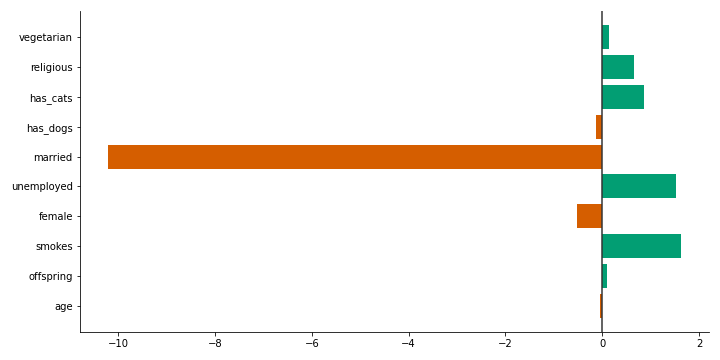

# The most common traits of substance abuse

An exploratory analysis of substance abuse among OkCupid users, made with Python, Jupyter Notebook, and Scikit-learn.

Please read my [blog post](https://brunoarine.com/blog/the-most-common-traits-of-substance-abuse/) about it, or take a look at the Jupyter notebook for all technical details.

## Summary

In 2017, nearly 20 million American adults (almost 7% of the population) battled a substance abuse problem, costing the US more than $740 billion annually in lost workplace productivity, healthcare expenses, and crime-related costs, according to the [American Addiction Centers](https://americanaddictioncenters.org/rehab-guide/addiction-statistics).

Substance abuse has a cure, but many people are too ashamed to reach out for help, which makes the problem even harder to address. But what if we could tell whether someone has a potential problem with drugs without asking them explicitly?

This study tries to answer the following questions:

1. Which age group shows the largest percentage of people with a possible substance addiction problem? And does substance abuse disproportionately affect any gender?

2. Which profession is more vulnerable to substance abuse?

3. Are people with kids or partners less likely to have a substance abuse problem?

4. Are religious people less likely to have a substance abuse problem?

5. Does making healthy choices (e.g., not smoking or eating plant-based diets) correlate negatively with substance abuse?

And last but not least, I try to predict substance abuse with just the above criteria using a simple Logistic Regression model with L2 regularization.

## Disclaimer

This study has a few major caveats: 

- There are too few positive cases in the dataset, which can drastically affect the statistical power of the model's predictions.
- The model assumes that frequent drinking and drug using automatically translates into substance abuse problems, which may not always be the case.

Because of these drawbacks, **I strongly recommend against using this project as the basis for any decision involving human lives.** Even if it was a peer reviewed study (which it is not), more data and careful analysis would be required for any serious public policy regarding substance abuse.

## Results

The graph below presents the regression model's coefficients, which gives us an idea of how each variable affects the prediction.



Model's performance:

| Metric      | Value |
| ----------- | ----- |
| Accuracy    | 0.78  |
| Recall      | 0.83  |
| Specificity | 0.78  |
| aROC        | 0.84  |

By examining the bar plots and doing a 𝛘² test for each hypothesis, these were my findings: 

- When it comes to age, there’s a clear downward trend in substance abuse, so that the probability of finding anyone binge drinking or using drugs is nearly zero among the older groups.
- There’s also a significant difference between genders, but only in the 30 to 39 and 40+ age groups (p < 0.05).
- The unemployed category is at a higher risk of developing a substance abuse problem than any other category.
- Users with kids are way more likely to have substance problems in their early adulthood (p < 0.01), but this effect decreases (and even reverses) as they get older (p < 0.05).
- People with stable relationships are less likely to have a substance abuse problem.
- Owning a cat seems to correlate with substance abuse.
- Religious people are among the likeliest to have a substance abuse problem in all age groups (p < 0.01).
- Vegetarianism didn’t correlate with substance abuse, either negatively or positively.
- Smoking is the best predictor of potential substance abuse problems, being common in all age groups (p < 0.0001).


## View the notebook

You can view the notebook [here on Github](https://github.com/brunoarine/substance-problem-study/blob/main/notebooks/project.ipynb) or on [nbviewer](https://nbviewer.jupyter.org/github/brunoarine/substance-problem-study/blob/main/notebooks/project.ipynb).

## Try the notebook

In your shell prompt, type the following:

```sh
git clone https://github.com/brunoarine/substance-problem-study.git
```

After that, download the [OkCupid Profile Dataset](https://github.com/rudeboybert/JSE_OkCupid) and extract it to `/data`.

## Dependencies

- matplotlib 3.3.4
- scipy 1.6.1
- seaborn 0.11.1
- pandas 1.2.3
- numpy 1.20.1
- scikit-learn 0.24.1

## Acknowledgements

Thanks [Albert Y. Kim & Adriana Escobedo-Land](https://github.com/rudeboybert/JSE_OkCupid) for providing the OkCupid dataset on GitHub, and Iris Rohr for the immense patience in proofreading my draft.
